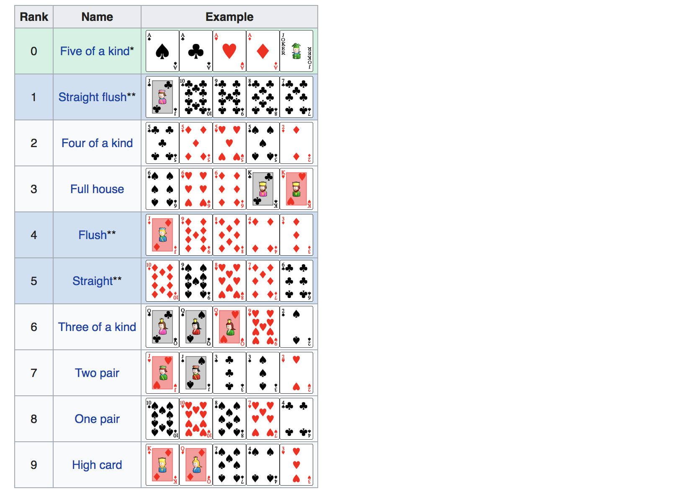
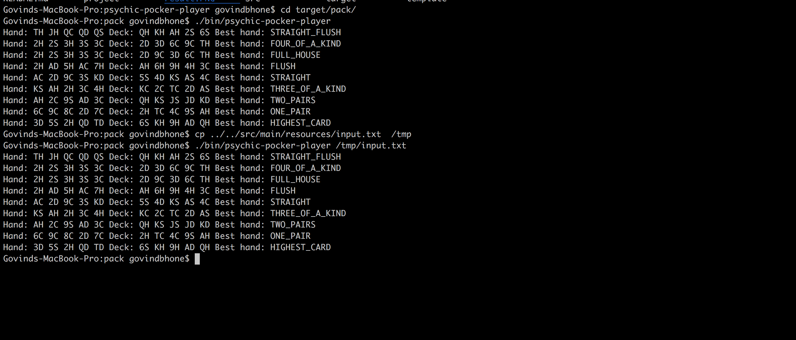

# The Psychic Poker Player 

Table of contents
=================

  * [Problem Statement ](#problem-statement)
  * [System requierments](#system-requierments)
  * [Steps to build](#steps-to-build)
  * [Steps to run](#steps-to-run)
  * [Steps to run unit Spec](#steps-to-run-unit-spec)
  * [Running evaluation](#running-evaluation)
  * [Expected Output](#expected-output)
  


## Problem Statement 

The purpose of this code challenge is to demonstrate problem solving and code quality.  

Unless otherwise specified when receiving this excercise, 
any language can be used to solve the problem and any libraries may be used except any Poker related libraries.  

The Problem
-----------
In 5-card draw poker, a player is dealt a hand of five cards (which may be looked at). 
The player may then discard between zero and five of his or her cards 
and have them replaced by the same number of cards from the top of the deck (which is face down). 
The object is to maximize the value of the final hand. For the different values of hands in poker see the References.

Normally the player cannot see the cards in the deck and so must use probability to decide which cards to discard. 
In this problem, we imagine that the poker player is psychic and knows which cards are on top of the deck. 
Write a program which advises the player which cards to discard so as to maximize the value of the resulting hand.

### Ranking Algorithm



Input and Output
----------------
Input will consist of a series of lines, each containing the initial five cards in the hand then the first five cards on top of the deck. Each card is represented as a two-character code. The first character is the face-value (A=Ace, 2-9, T=10, J=Jack, Q=Queen, K=King) and the second character is the suit (C=Clubs, D=Diamonds, H=Hearts, S=Spades). Cards will be separated by single spaces. Each input line will be from a single valid deck, that is there will be no duplicate cards in each hand and deck.

Each line of input should produce one line of output, consisting of the initial hand, the top five cards on the deck, 
and the best value of hand that is possible. Input is terminated by end of file.

Use the sample input and output as a guide. Note that the order of the cards in the player's hand is irrelevant, 
but the order of the cards in the deck is important because the discarded cards must be replaced from the top of the deck. 
Also note that examples of all types of hands appear in the sample output, with the hands shown in decreasing order of value.

Sample Input
------------
```
TH JH QC QD QS QH KH AH 2S 6S  
2H 2S 3H 3S 3C 2D 3D 6C 9C TH  
2H 2S 3H 3S 3C 2D 9C 3D 6C TH  
2H AD 5H AC 7H AH 6H 9H 4H 3C  
AC 2D 9C 3S KD 5S 4D KS AS 4C  
KS AH 2H 3C 4H KC 2C TC 2D AS  
AH 2C 9S AD 3C QH KS JS JD KD  
6C 9C 8C 2D 7C 2H TC 4C 9S AH  
3D 5S 2H QD TD 6S KH 9H AD QH  
```


Sample Output
-------------
```
Hand: TH JH QC QD QS Deck: QH KH AH 2S 6S Best hand: straight-flush  
Hand: 2H 2S 3H 3S 3C Deck: 2D 3D 6C 9C TH Best hand: four-of-a-kind  
Hand: 2H 2S 3H 3S 3C Deck: 2D 9C 3D 6C TH Best hand: full-house  
Hand: 2H AD 5H AC 7H Deck: AH 6H 9H 4H 3C Best hand: flush  
Hand: AC 2D 9C 3S KD Deck: 5S 4D KS AS 4C Best hand: straight  
Hand: KS AH 2H 3C 4H Deck: KC 2C TC 2D AS Best hand: three-of-a-kind  
Hand: AH 2C 9S AD 3C Deck: QH KS JS JD KD Best hand: two-pairs  
Hand: 6C 9C 8C 2D 7C Deck: 2H TC 4C 9S AH Best hand: one-pair  
Hand: 3D 5S 2H QD TD Deck: 6S KH 9H AD QH Best hand: highest-card  
```
## System Requirements 
 * Java Runtime Environment above 7 (http://www.oracle.com/technetwork/indexes/downloads/index.html#java)
 * sbt (http://www.scala-sbt.org/0.13/docs/Installing-sbt-on-Linux.html)

## Steps to Build 
 * clone the git repo 
 * go to root folder of the project 
 * Run command `sbt compile`
 * Run command `sbt pack or sbt packArchive`

## Steps to run Unit Spec
 * sbt test

## Steps to Run 
 * go to <ROOT_PROJECT_DIR>/target/pack
 * Run `./bin/psychic-pocker-player` OR `./bin/psychic-pocker-player /tmp/input.txt`
 
## Running Evaluation 
This program approx takes very less time to execute

## Expected Output 

